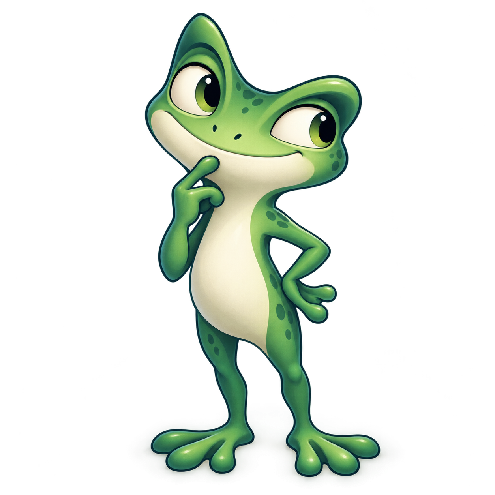

# Sapinho das Ideias — exemplo de personagem

Este exemplo documenta uma sequência de produção **raster conceitual → reconstrução vetorial → rig de animação**. O personagem é original. A arte em [`concept-master.png`](concept-master.png) é a referência principal de identidade, proporção, cor, expressão e pose. [`premium-frog.svg`](premium-frog.svg) é uma reconstrução **simplificada** em paths e grupos editáveis para movimento; não contém a PNG incorporada. A [ficha de desenvolvimento](character-sheet.svg) compara os artefatos e registra limites.

## Direção do personagem

O sapinho é curioso e deliberado: observa antes de tocar, pensa com um dedo no queixo e só então age. A identidade não depende de roupa nem de óculos. O contorno tem uma crista ocular esquerda alta e estreita e outra à direita longa e baixa; o olho direito fica abaixo do esquerdo. A mandíbula clara continua visualmente no ventre, o corpo é esguio, e pés largos de três dedos sustentam a postura. A mão esquerda toca o queixo; a direita repousa na cintura. A diferença de altura entre as cristas, o vão entre os olhos e a assimetria da cabeça devem sobreviver a qualquer pose.

As cores principais da reconstrução são lima claro `#c9ed8a`, jade `#5eb56b`, sombra verde `#258d67`, mandíbula e ventre marfim `#f6f3ce`, e contorno petróleo `#103f3d`. Gradientes controlados dão volume sem transformar manchas de luz em novos volumes anatômicos. As pintas escuras são secundárias; a forma precisa ser reconhecível em uma cor só.

## Hierarquia das referências

| Artefato | Uso | Limite |
| --- | --- | --- |
| [`concept-master.png`](concept-master.png) | Fonte principal para proporção, cor, expressão curiosa, mão no queixo e mão na cintura | Raster único, sem turnaround. |
| [`concept-views.png`](concept-views.png) | Guia secundário de volumes em frente e perfil | Muda a pose dos braços e alguns olhos/pintas. Essas diferenças não substituem a arte mestre. |
| [`premium-frog.svg`](premium-frog.svg) | Fonte vetorial editável para articular cabeça, tronco, braços, mãos, pernas, pés e olhar | Reduz textura e luz complexa; ainda precisa de revisão em movimento. |
| [`character-sheet.svg`](character-sheet.svg) | Comparação lado a lado e registro de decisões | Não declara perfil vetorial, 3/4 nem costas como aprovados. |

O perfil da segunda imagem ajuda a entender que o focinho projeta para a frente, a crista alta conserva sua altura e a mandíbula marfim desce ao tronco. Ele **não** resolve sozinho a rotação completa: a vista de 3/4, as costas, as oclusões de braço e um perfil vetorial consistente ainda precisam ser desenhados e revisados. Não interpolar essas vistas a partir da frente como se existissem quadros aprovados.

## Construção do SVG

`premium-frog.svg` usa `viewBox="0 0 1024 1024"` e raiz `premium-character`. Os grupos visuais são paths SVG; nenhum `<image>` aparece no vetor. A ordenação das camadas é intencional: pernas atrás do tronco; braço direito; braço esquerdo superior; cabeça; antebraço esquerdo e mão sobre a mandíbula. A conexão entre o cotovelo esquerdo e a mão é uma articulação visível, não uma mão flutuante.

| Grupo | Pivô em coordenadas do viewBox | Função |
| --- | --- | --- |
| `premium-head` | `(505, 372)` | Inclinação da cabeça; preservar encontro entre mandíbula e ventre. |
| `premium-body` | `(511, 543)` | Peso, inclinação e compressão leve do tronco. |
| `premium-arm-left` | `(391, 374)` | Braço superior que sai do ombro esquerdo. |
| `premium-forearm-left` | `(360, 475)` | Dobra do cotovelo até o punho perto do queixo. |
| `premium-hand-left` | `(417, 394)` | Dedo no queixo e abertura da mão. |
| `premium-arm-right` | `(564, 412)` | Braço apoiado na cintura. |
| `premium-hand-right` | `(610, 566)` | Ajustes finos de mão e dedos. |
| `premium-arm-right-bridge` | `(564, 412)` | Quadro anatômico intermediário; ponta da mão em torno de `(719, 530)`. |
| `premium-hand-right-bridge` | `(699, 522)` | Mão da pose intermediária. |
| `premium-arm-right-reach` | `(564, 412)` | Braço de alcance; ponta da mão em `(765, 422)` antes da rotação. |
| `premium-hand-right-reach` | `(725, 434)` | Orientação dos dedos no alcance e contato. |
| `premium-leg-left` / `premium-leg-right` | `(452, 658)` / `(577, 660)` | Transferência de peso e pequeno salto. |
| `premium-foot-left` / `premium-foot-right` | `(476, 890)` / `(609, 892)` | Contato com o chão; a arte interna tem alinhamentos de `translate(0 -1)` e `translate(1 -1)` para corresponder ao concept master, sem mudar o pivô das pernas. |

`premium-eye-left/right` separam as áreas dos olhos; `premium-pupil-left/right` aceitam direção de olhar. `premium-lid-left/right` começam transparentes e são pontos para piscadas. `premium-mouth` é o grupo do sorriso e seu canto direito; `premium-mouth-aha`, `premium-mouth-think` e `premium-mouth-grin` começam ocultos e compartilham a mesma construção facial. Uma expressão ativa deve ocultar as outras, inclusive o sorriso. O SVG guarda `data-pivot-x/y` para comunicar os pivôs; o código de animação ainda deve aplicá-los ao transformar os grupos.

O braço direito tem três silhuetas completas — repouso, ponte e alcance — porque girar o braço dobrado até a faísca deformava o cotovelo. A página interpola os contornos em uma única mão visível durante a troca. A ponte não valida automaticamente os intervalos: confira os quadros antes, durante e depois da transição, especialmente a junção de ombro, o cotovelo e a separação dos dedos. O espaço entre os dedos da mão no queixo é transparente e revela a mandíbula nesta pose frontal; uma pose que afaste a mão do rosto exige nova checagem de oclusão, forma e volume do dedo curvado.

Ao inserir o personagem numa cena menor, escale a raiz inteira com o mesmo fator em X e Y e mantenha os pivôs no sistema do `viewBox` original. O objeto externo da história deve continuar em uma camada própria. A mão esquerda cruza a mandíbula; o rig precisa preservar essa ordem de oclusão e sincronizar braço superior, antebraço e punho por uma pose compartilhada. Rotação extrema da cabeça pode abrir uma fenda entre mandíbula e ventre; nesse caso, limite o ângulo ou construa um trecho de pescoço de ponte.

## Atuação da cena

| Tempo aproximado | Ação e leitura |
| --- | --- |
| `0–1,05 s` | Olhos procuram a faísca antes da cabeça. |
| `1,05–2,20 s` | Peso comprime e braço alcança; os dedos fecham no contato. |
| `2,20–2,42 s` | Descoberta breve, com mudança clara do rosto. |
| `2,42–2,90 s` | Pausa de pensamento com mão próxima ao queixo. |
| `2,90–3,45 s` | Olhar muda para o alvo antes do impulso e da liberação. |
| `3,45–4,60 s` | Faísca viaja separada da mão até o alvo. |
| `4,60–5,80 s` | Alvo reage primeiro; o sapinho responde com um salto curto e assenta. |

O rig foi escolhido porque a história pede interação reversível, scrub e sincronização exata da mão com a faísca. A amplitude dos braços e as oclusões de pescoço e mãos ainda dependem de QA nas poses extremas. Uma sequência RGBA exigiria imagens completas e auditoria de identidade em cada intervalo; vídeo serviria melhor a uma cena fixa, com menos estados interativos. `5,8 s × 30 fps = 174` posições temporais e `5,8 s × 60 fps = 348`, mas o vetor não exige esse número de desenhos. `requestAnimationFrame` agenda atualizações; **não prova** 60 quadros distintos exibidos do personagem. A fluidez deve ser medida no navegador e no dispositivo de destino.

## Controles e revisão

A página em `index.html` usa o vetor premium e oferece pausa, retomada, replay, scrub e movimento reduzido. Sem JavaScript, deve permanecer uma pose estática compreensível. Após cada edição em `premium-frog.svg`, sincronizar a cena com `scripts/sync_frog_scene.py` e verificar novamente esses estados; uma captura estática do SVG isolado não valida a atuação.

### Estado da revisão visual

Em `2026-09-28`, revisões independentes deram **79/100**, **82/100**, **76/100**, **81/100** e **82/100** a versões anteriores. Depois delas, foram alterados o sombreamento do rosto, o contorno da mão no queixo, o gradiente da coxa e um vinco do pé direito. A revisão independente **desta versão** deu **83/100**: silhueta 28/30, anatomia/pose 20/25, rosto 17/20, paleta/material 11/15 e detalhes/oclusão 7/10. A crista, a mandíbula e a ligação da perna direita melhoraram, mas a mão em escala de cena ainda tende a Y, a coxa e os pés têm volumes geométricos, e o olhar/sorriso diferem do master. A sombra escura da crista também ficou rígida em uma área. **A meta visual de 95/100 não passou.**

Na versão SVG presente, `scripts/render_svg_for_comparison.cjs` e `scripts/measure_silhouette.py` mediram **95,06% de IoU de silhueta** (`0,950648`) contra `concept-master.png`, em canvas de `1254 × 1254` com alfa ≥ 128. A medida supera o mínimo de 95% **somente no contorno externo**; o JSON retorna `overall_character_gate: not_evaluated`. A [comparação completa](qa/2026-09-28/side-by-side.png), a [sobreposição](qa/2026-09-28/overlay-50.png), o [resultado JSON](qa/2026-09-28/silhouette-result.json), a [escala de cena](qa/2026-09-28/scene-scale.png) e os closes abaixo foram regenerados do SVG desta iteração. O personagem **não está aprovado visualmente**; IoU não é nota de fidelidade total.

| Parte | Evidência desta versão | Estado e defeito que ainda exige revisão |
| --- | --- | --- |
| Olho esquerdo | [Rosto em 100%](qa/2026-09-28/eyes-mouth.png) | **Pendente.** Globo mais aberto e uniforme que o master; volume da pálpebra e relação íris/pupila ainda diferem. |
| Olho direito | [Rosto em 100%](qa/2026-09-28/eyes-mouth.png) | **Pendente.** Arco superior e base ainda geométricos; inclinação e sombra interna precisam aproximar o raster. |
| Boca e mandíbula | [Rosto em 100%](qa/2026-09-28/eyes-mouth.png), [boca O estática](qa/2026-09-28/mouth-aha-static.png) | **Pendente.** A abertura de descoberta está no marfim e foi conferida na cena em 2,3 s. A sombra melhorou, mas o sorriso segue uma linha fina e a mandíbula parece uma faixa lisa diante do master. |
| Tronco e quadril | [Corpo inferior](qa/2026-09-28/hips-legs-feet.png) | **Pendente.** A coxa direita inicia com cor próxima ao tronco e contorno interno progressivo, sem corte preto central; ainda é mais geométrica que no master. |
| Mão no queixo | [Close da mão](qa/2026-09-28/hand-left.png) | **Pendente.** O contorno foi refinado sem laço fechado, mas a revisão ainda o lê como Y/gancho na escala de cena; dedo curvado e palma não têm o mesmo volume e oclusão da referência. |
| Mão na cintura | [Close da mão](qa/2026-09-28/hands-right.png) | **Pendente.** A revisão reconheceu duas pontas, mas a base em V parece pinça sem volume da palma ou juntas; conferir também as três poses do braço. |
| Pernas e pés | [Quadril a pés](qa/2026-09-28/hips-legs-feet.png), [escala de cena](qa/2026-09-28/scene-scale.png) | **Pendente.** Os três dedos de cada pé são legíveis; o novo vinco ajuda no direito. A revisão ainda vê o pé esquerdo plano, base direita larga e transição da coxa para canela mais abrupta que no master. |

Esses estados são deliberadamente separados da aprovação da silhueta. Inspecionar também as poses extremas da cena após sincronizar o SVG no HTML.

### Medição de quadros no navegador

O script [`scripts/measure_frog_trace.cjs`](../../scripts/measure_frog_trace.cjs) permite repetir uma comparação A/B headless de cerca de `2,5 s` em Chrome, janela `1600 × 1000` e viewport interno `1600 × 857`. Em uma **execução anterior a esta iteração**, sem filmstrip, a coleta registrou **151 eventos `DrawFrame` e 0 `DroppedFrame`**; com filmstrip, **109 `DrawFrame`, 42 `DroppedFrame` e 110 capturas**. Nos 109 pares do recorte do personagem (`x=976–1222`, `y=246–736` em pixels CSS), **107** mudaram acima do limiar de diferença RGB média `0,2/255`, **1** repetiu exatamente e **1** foi quase imóvel. A faísca foi contada em região separada; o alvo permaneceu estático nesse trecho. Repetir a medição após sincronizar esta versão no HTML.

Filmstrip tem custo próprio e alterou o resultado A/B. `DrawFrame` e `DroppedFrame` são eventos do compositor, enquanto a comparação de imagens testa alteração visível do recorte; nenhum desses números isolado prova 60 fps exibidos do personagem em um celular ou mede a varredura física da tela. Repetir no navegador e dispositivo de destino, com e sem captura, e registrar as retenções de imagem.

Antes de aprovar o personagem, testar:

1. **Silhueta:** reconhecer o mesmo sapinho sem cor, olhos, pintas ou acessórios em 24, 48 e 96 pixels.
2. **Continuidade:** comparar cristas, distância dos olhos, focinho, mandíbula, proporção de tronco, dedos e manchas em cada pose principal. A vista lateral secundária não autoriza mover pintas arbitrariamente.
3. **Acting:** diferenciar curiosidade, descoberta, pensamento, decisão e resultado sem rótulos; verificar se olhos antecipam cabeça/mãos.
4. **Contato e oclusão:** inspecionar dedo/queixo, braço/mandíbula, fechamento da mão na faísca, liberação e contato no alvo. Rejeitar mão flutuante ou membro que atravessa o rosto.
5. **Acesso:** teclado, toque, pausa, retomada, replay, busca, fallback e preferência de movimento reduzido.
6. **Desempenho:** contar quadros visuais distintos realmente apresentados e quadros perdidos no navegador alvo; identificar retenções longas e saltos no movimento.

O vetor é um passo de produção e ainda não representa, por si só, acabamento final de um estúdio de personagens. Faltam duas avaliações independentes aprovadas, turnaround aprovado, múltiplas expressões finais e teste de desempenho em dispositivos reais.

## Executar localmente

Sirva este diretório como site estático, por exemplo com `python3 -m http.server 4177 --bind 0.0.0.0`, e abra `http://localhost:4177/`. Mantenha `concept-master.png`, `concept-views.png`, `premium-frog.svg` e `character-sheet.svg` no mesmo diretório para a ficha carregar as três referências.
